# Architecture: LuaHelper MCP Server

> **Date:** 2026-08-12
> **Author:** Senior Software Architect Agent
> **Input:** `.github\docs\research-luahelper-mcp-server.md`
> **Status:** Draft for review

---

## Table of Contents

1. [System Overview](#1-system-overview)
2. [Component Architecture](#2-component-architecture)
3. [Sequence Diagrams](#3-sequence-diagrams)
4. [Data Flow](#4-data-flow)
5. [State Machine: lualsp.exe Lifecycle](#5-state-machine-lualspexe-lifecycle)
6. [Detailed Component Design](#6-detailed-component-design)
7. [Error Handling](#7-error-handling)
8. [Threading Model](#8-threading-model)
9. [Configuration](#9-configuration)
10. [Testing Strategy](#10-testing-strategy)
11. [Development Phases](#11-development-phases)
12. [Project Structure](#12-project-structure)
13. [Open Questions: Decisions](#13-open-questions-decisions)
14. [Technology Stack Summary](#14-technology-stack-summary)

---

## 1. System Overview

**LuaHelper MCP Server** is a .NET 10 application that wraps Tencent's `lualsp.exe` (a Go-based LSP server for Lua) and exposes its diagnostics capabilities through the Model Context Protocol (MCP). This allows AI coding assistants (GitHub Copilot, Claude Desktop, etc.) to query Lua code diagnostics programmatically.

### High-Level Architecture

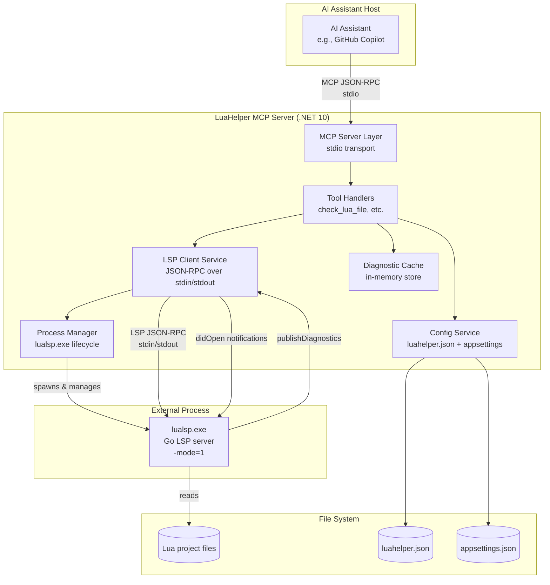

### Key Design Principles

1. **Thin wrapper** — The MCP server is a translation layer between MCP protocol and LSP protocol. No business logic beyond orchestration.
2. **Stateful LSP, stateless MCP** — `lualsp.exe` maintains project state in memory; the MCP server manages this state and exposes it through stateless tool calls.
3. **Single responsibility** — Each component has one job: MCP protocol handling, LSP communication, process management, caching, or configuration.
4. **Resilience** — `lualsp.exe` crashes are handled transparently with auto-restart and cached fallback.
5. **AOT-compatible** — All code uses attribute-based MCP tool registration (no runtime reflection), enabling NativeAOT compilation.

---

## 2. Component Architecture

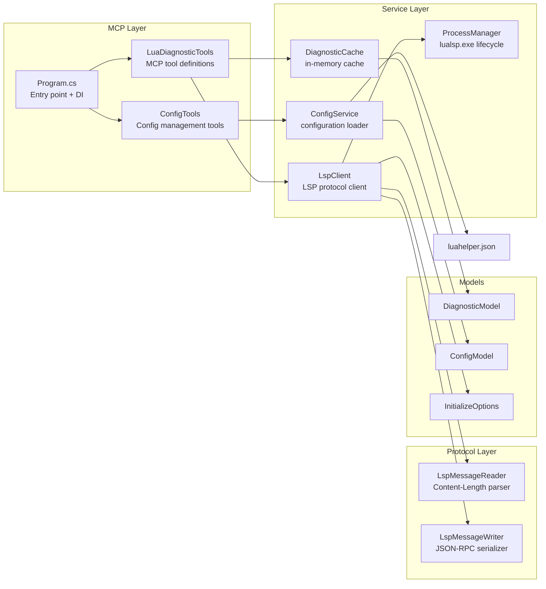

### Component Responsibilities

| Component | Responsibility | Dependencies |
|---|---|---|
| `Program.cs` | DI container setup, host configuration, stdio transport registration | MCP SDK, all services |
| `LuaDiagnosticTools` | MCP tool definitions (`check_lua_file`, `check_lua_project`, `get_supported_checks`, `get_luahelper_version`) | `ILspClient`, `IDiagnosticCache`, `IConfigService` |
| `ConfigTools` | MCP tools for config management (`get_luahelper_config`, `create_luahelper_json`) | `IConfigService` |
| `DiagnosticResources` | MCP resources (`luahelper://diagnostics/{+filePath}`, `luahelper://config`) | `ILspClient`, `IDiagnosticCache`, `IConfigService` |
| `LuaHelperPrompts` | MCP prompts (`fix_lua_warnings`, `configure_luahelper`) | — |
| `ILspClient` / `LspClient` | LSP protocol implementation: initialize, didOpen, receive diagnostics | `IProcessManager`, `LspMessageReader`, `LspMessageWriter` |
| `IProcessManager` / `ProcessManager` | Spawn, monitor, restart, and kill `lualsp.exe` | `System.Diagnostics.Process` |
| `IDiagnosticCache` / `DiagnosticCache` | Store and retrieve diagnostics by file URI | — |
| `IConfigService` / `ConfigService` | Load/merge `luahelper.json` + `appsettings.json` | File I/O |
| `LspMessageReader` | Parse `Content-Length`-framed JSON-RPC messages from a stream | `System.Text.Json` |
| `LspMessageWriter` | Serialize and frame JSON-RPC messages with `Content-Length` headers | `System.Text.Json` |

---

## 3. Sequence Diagrams

### 3.1 Check Single Lua File

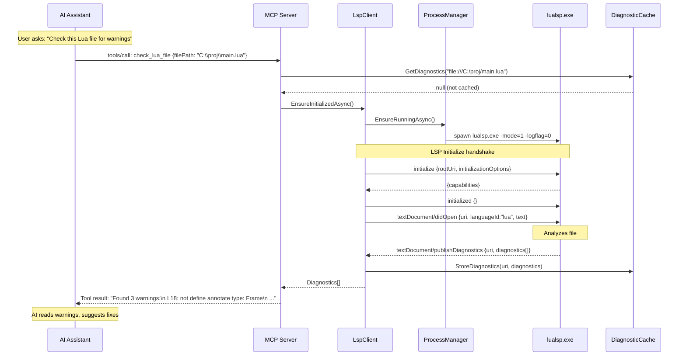

### 3.2 Check Entire Project

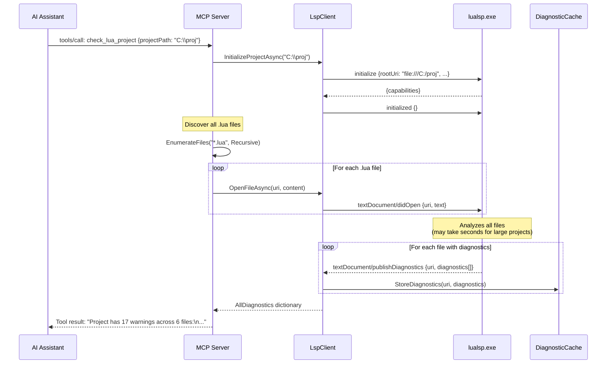

### 3.3 Process Crash Recovery

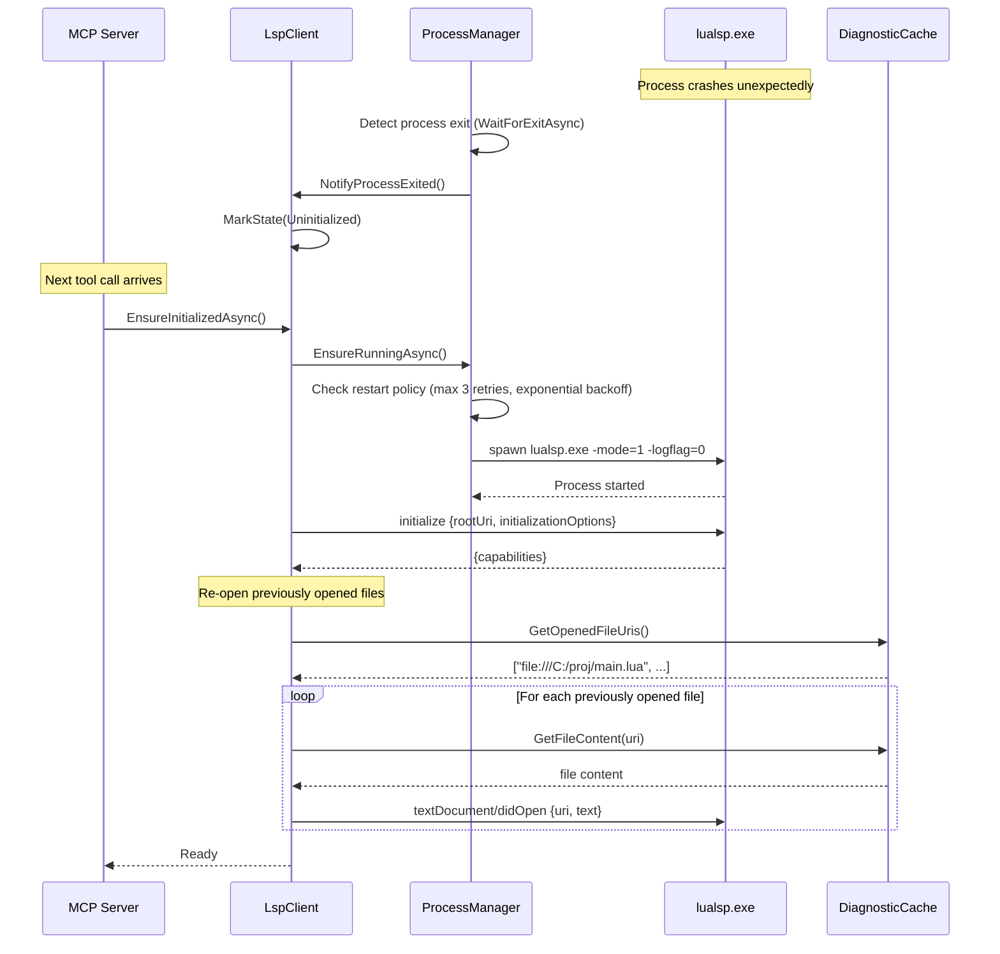

---

## 4. Data Flow

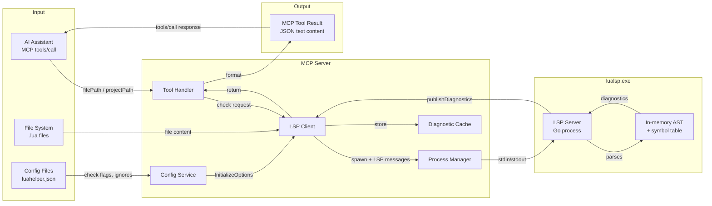

### Diagnostic Data Model

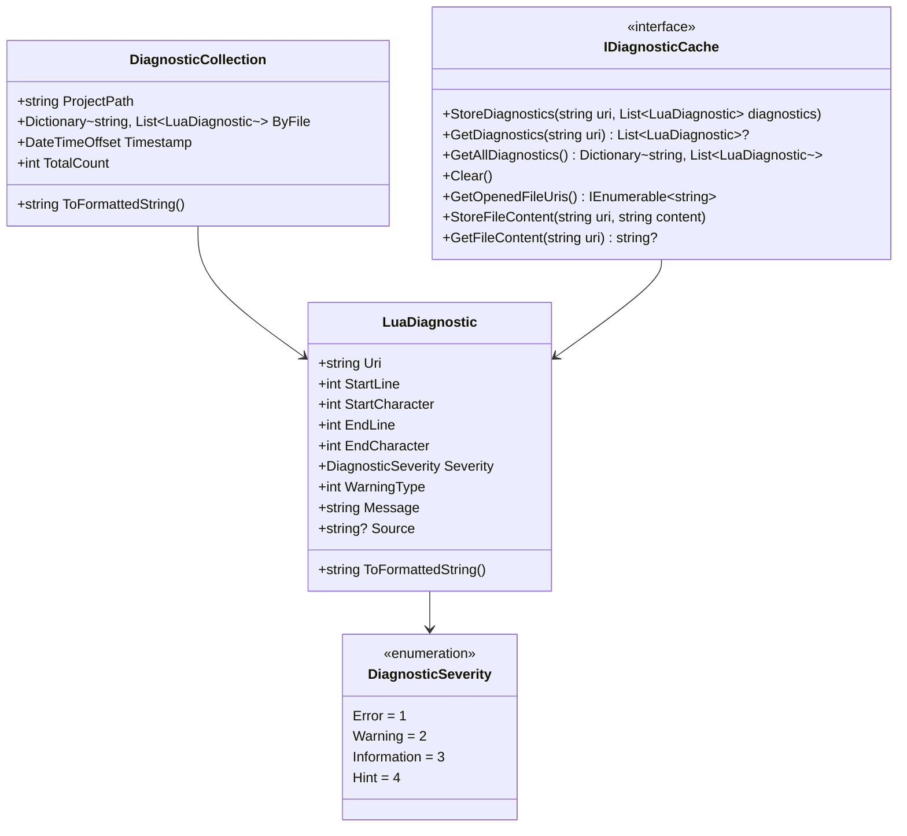

---

## 5. State Machine: lualsp.exe Lifecycle

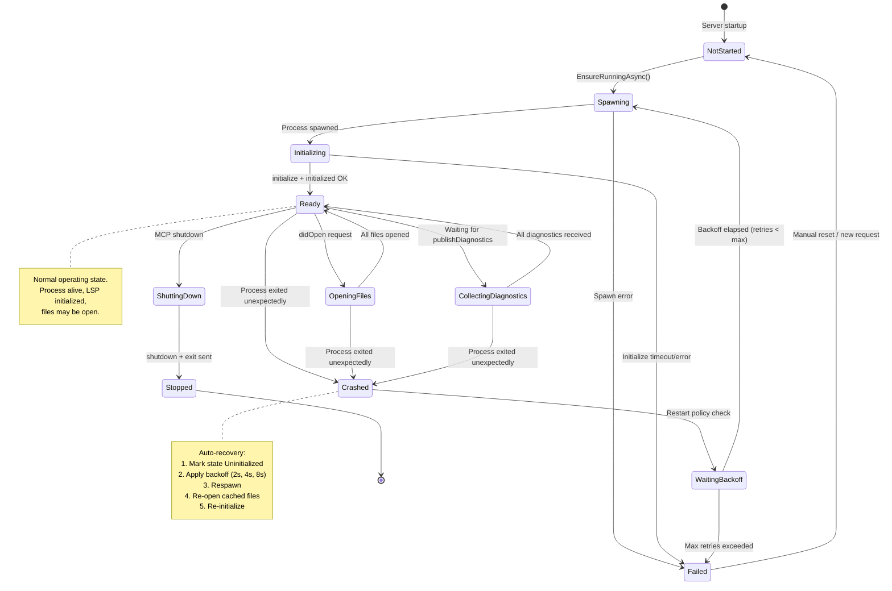

### State Transitions

| From | To | Trigger | Action |
|---|---|---|---|
| `NotStarted` | `Spawning` | `EnsureRunningAsync()` called | Start process |
| `Spawning` | `Initializing` | Process started successfully | Send LSP `initialize` |
| `Initializing` | `Ready` | `initialize` response received | Send `initialized` notification |
| `Ready` | `OpeningFiles` | `OpenFileAsync()` called | Send `textDocument/didOpen` |
| `Ready` | `Crashed` | Process exit detected | Mark uninitialized, notify |
| `Crashed` | `WaitingBackoff` | Auto-restart triggered | Start backoff timer |
| `WaitingBackoff` | `Spawning` | Backoff elapsed, retries remain | Respawn process |
| `Ready` | `ShuttingDown` | MCP server shutdown | Send LSP `shutdown` + `exit` |
| `ShuttingDown` | `Stopped` | Process exited | Cleanup resources |

---

## 6. Detailed Component Design

### 6.1 Program.cs — Entry Point

```csharp
// Program.cs
using Microsoft.Extensions.DependencyInjection;
using Microsoft.Extensions.Hosting;
using Microsoft.Extensions.Logging;
using LuaHelperMcpServer.Services;
using LuaHelperMcpServer.Tools;

var builder = Host.CreateEmptyApplicationBuilder(settings: null);

builder.Logging.AddConsole(options =>
{
    options.LogToStandardErrorThreshold = LogLevel.Trace;
});

builder.Services
    .AddMcpServer()
    .WithStdioServerTransport()
    .WithToolsFromAssembly();

// Register services
builder.Services.AddSingleton<IProcessManager, ProcessManager>();
builder.Services.AddSingleton<ILspClient, LspClient>();
builder.Services.AddSingleton<IDiagnosticCache, DiagnosticCache>();
builder.Services.AddSingleton<IConfigService, ConfigService>();

builder.Services.Configure<LuaHelperOptions>(
    builder.Configuration.GetSection("LuaHelper"));

await builder.Build().RunAsync();
```

### 6.2 ILspClient / LspClient

```csharp
public interface ILspClient
{
    /// <summary>Current state of the LSP connection.</summary>
    LspState State { get; }

    /// <summary>Ensures lualsp.exe is running and initialized for the given project.</summary>
    Task EnsureInitializedAsync(string projectPath, LuaHelperConfig config, CancellationToken ct = default);

    /// <summary>Opens a file in the LSP server for analysis.</summary>
    Task OpenFileAsync(string filePath, CancellationToken ct = default);

    /// <summary>Requests diagnostics for a file and waits for the result.</summary>
    Task<List<LuaDiagnostic>> GetDiagnosticsAsync(string filePath, CancellationToken ct = default);

    /// <summary>Gets all diagnostics received so far.</summary>
    IReadOnlyDictionary<string, List<LuaDiagnostic>> GetAllDiagnostics();

    /// <summary>Shuts down the LSP server gracefully.</summary>
    Task ShutdownAsync(CancellationToken ct = default);
}

public sealed class LspClient : ILspClient, IDisposable
{
    private readonly IProcessManager _processManager;
    private readonly IDiagnosticCache _cache;
    private readonly ILogger<LspClient> _logger;

    private LspState _state = LspState.NotStarted;
    private string? _projectPath;
    private LuaHelperConfig? _config;
    private int _nextRequestId = 1;
    private readonly ConcurrentDictionary<int, TaskCompletionSource<JsonElement>> _pendingRequests = new();
    private readonly Channel<JsonElement> _diagnosticChannel = Channel.CreateUnbounded<JsonElement>();

    // Properties: State, projectPath, config
    // Methods: EnsureInitializedAsync, OpenFileAsync, GetDiagnosticsAsync, GetAllDiagnostics, ShutdownAsync
    // Internal: SendMessage, SendNotification, ReadLoop, HandleNotification
}
```

**Key methods:**

| Method | Description |
|---|---|
| `EnsureInitializedAsync` | Checks state; if not ready, calls `_processManager.EnsureRunningAsync()`, sends LSP `initialize` with `initializationOptions`, sends `initialized` notification |
| `OpenFileAsync` | Reads file content, sends `textDocument/didOpen`, stores content in cache for crash recovery |
| `GetDiagnosticsAsync` | Opens file if not already open, waits for `publishDiagnostics` notification (with timeout), returns diagnostics from cache |
| `ReadLoop` | Background task: reads `Content-Length`-framed messages from stdout, dispatches responses to `_pendingRequests`, routes `publishDiagnostics` to cache + channel |
| `ShutdownAsync` | Sends LSP `shutdown` request, then `exit` notification, waits for process exit |

### 6.3 IProcessManager / ProcessManager

```csharp
public interface IProcessManager
{
    bool IsRunning { get; }
    event EventHandler? ProcessExited;

    Task EnsureRunningAsync(CancellationToken ct = default);
    Task<Process> GetProcessAsync(CancellationToken ct = default);
    Task ShutdownAsync(CancellationToken ct = default);
    void ForceKill();
}

public sealed class ProcessManager : IProcessManager, IDisposable
{
    private readonly ILogger<ProcessManager> _logger;
    private Process? _process;
    private int _restartAttempts;
    private readonly TimeSpan[] _backoffSchedule = [TimeSpan.FromSeconds(2), TimeSpan.FromSeconds(4), TimeSpan.FromSeconds(8)];
    private const int MaxRestarts = 3;

    // Properties: IsRunning, ProcessExited event
    // Methods: EnsureRunningAsync, GetProcessAsync, ShutdownAsync, ForceKill
    // Internal: SpawnProcess, OnProcessExited, WaitForExitAsync
}
```

**Restart policy:**
- Max 3 restart attempts per crash
- Exponential backoff: 2s → 4s → 8s
- After max retries: return error to caller, reset on next manual request
- On restart: `ProcessExited` event fires → `LspClient` marks state as `Crashed` → next request triggers re-initialization

### 6.4 LspMessageReader / LspMessageWriter

```csharp
public sealed class LspMessageReader
{
    private readonly Stream _stream;
    private readonly byte[] _buffer = new byte[8192];

    public async Task<JsonElement?> ReadMessageAsync(CancellationToken ct = default)
    {
        // 1. Read until we find "\r\n\r\n"
        // 2. Parse "Content-Length: N" from headers
        // 3. Read exactly N bytes as the JSON body
        // 4. Parse JSON and return
    }
}

public sealed class LspMessageWriter
{
    private readonly Stream _stream;

    public async Task SendRequestAsync(int id, string method, object? parameters, CancellationToken ct = default)
    {
        var body = JsonSerializer.SerializeToUtf8Bytes(new { jsonrpc = "2.0", id, method, @params = parameters });
        var header = Encoding.ASCII.GetBytes($"Content-Length: {body.Length}\r\n\r\n");
        await _stream.WriteAsync(header, ct);
        await _stream.WriteAsync(body, ct);
        await _stream.FlushAsync(ct);
    }

    public async Task SendNotificationAsync(string method, object? parameters, CancellationToken ct = default)
    {
        // Same as SendRequestAsync but without "id"
    }
}
```

### 6.5 MCP Tool Definitions

```csharp
[McpServerToolType]
public sealed class LuaDiagnosticTools
{
    private readonly ILspClient _lspClient;
    private readonly IDiagnosticCache _cache;
    private readonly IConfigService _configService;

    // Injected via DI
    public LuaDiagnosticTools(ILspClient lspClient, IDiagnosticCache cache, IConfigService configService)
    {
        _lspClient = lspClient;
        _cache = cache;
        _configService = configService;
    }

    [McpServerTool(Name = "check_lua_file")]
    [Description("Run LuaHelper diagnostics on a single .lua file. Returns warnings and errors with line numbers.")]
    public async Task<string> CheckLuaFile(
        [Description("Absolute path to the .lua file to check")] string filePath,
        CancellationToken ct)
    {
        if (!File.Exists(filePath))
            return $"Error: File not found: {filePath}";

        var config = _configService.GetConfig(Path.GetDirectoryName(filePath)!);
        await _lspClient.EnsureInitializedAsync(config.ProjectPath, config, ct);
        await _lspClient.OpenFileAsync(filePath, ct);
        var diagnostics = await _lspClient.GetDiagnosticsAsync(filePath, ct);

        return FormatDiagnostics(filePath, diagnostics);
    }

    [McpServerTool(Name = "check_lua_project")]
    [Description("Run LuaHelper diagnostics on an entire Lua project. Scans all .lua files recursively.")]
    public async Task<string> CheckLuaProject(
        [Description("Absolute path to the project root directory")] string projectPath,
        CancellationToken ct)
    {
        if (!Directory.Exists(projectPath))
            return $"Error: Directory not found: {projectPath}";

        var config = _configService.GetConfig(projectPath);
        await _lspClient.EnsureInitializedAsync(projectPath, config, ct);

        var luaFiles = Directory.EnumerateFiles(projectPath, "*.lua", SearchOption.AllDirectories);
        foreach (var file in luaFiles)
        {
            await _lspClient.OpenFileAsync(file, ct);
        }

        // Wait for all diagnostics to arrive
        await Task.Delay(TimeSpan.FromSeconds(2), ct);

        var allDiags = _lspClient.GetAllDiagnostics();
        return FormatProjectDiagnostics(projectPath, allDiags);
    }

    [McpServerTool(Name = "get_supported_checks")]
    [Description("List all available LuaHelper check types with their IDs and descriptions.")]
    public Task<string> GetSupportedChecks(CancellationToken ct)
    {
        var checks = new[]
        {
            new { Id = 1, Name = "Syntax errors", DefaultOn = true },
            new { Id = 2, Name = "Variable not defined", DefaultOn = false },
            // ... all 22 types
            new { Id = 21, Name = "Float equality", DefaultOn = false },
        };
        return Task.FromResult(JsonSerializer.Serialize(checks, new JsonSerializerOptions { WriteIndented = true }));
    }

    [McpServerTool(Name = "get_luahelper_version")]
    [Description("Get the version of the bundled lualsp.exe binary.")]
    public Task<string> GetVersion(CancellationToken ct)
    {
        return Task.FromResult("LuaHelper lualsp.exe v0.2.29 (bundled)");
    }

    private static string FormatDiagnostics(string filePath, List<LuaDiagnostic> diagnostics)
    {
        if (diagnostics.Count == 0)
            return $"No warnings found in {filePath}";

        var sb = new StringBuilder();
        sb.AppendLine($"{diagnostics.Count} warning(s) in {filePath}:");
        foreach (var d in diagnostics)
        {
            sb.AppendLine($"  L{d.StartLine}:{d.StartCharacter} [{d.Severity}] {d.Message}");
        }
        return sb.ToString();
    }

    private static string FormatProjectDiagnostics(string projectPath, IReadOnlyDictionary<string, List<LuaDiagnostic>> all)
    {
        var total = all.Values.Sum(l => l.Count);
        if (total == 0)
            return $"No warnings found in project {projectPath}";

        var sb = new StringBuilder();
        sb.AppendLine($"Project {projectPath}: {total} warning(s) across {all.Count(k => k.Value.Count > 0)} file(s)");
        foreach (var (uri, diags) in all.Where(k => k.Value.Count > 0))
        {
            var filePath = uri.Replace("file:///", "").Replace("/", "\\");
            sb.AppendLine($"\n--- {filePath} ({diags.Count}) ---");
            foreach (var d in diags)
            {
                sb.AppendLine($"  L{d.StartLine}:{d.StartCharacter} [{d.Severity}] {d.Message}");
            }
        }
        return sb.ToString();
    }
}
```

### 6.6 ConfigTools

```csharp
[McpServerToolType]
public sealed class ConfigTools
{
    private readonly IConfigService _configService;

    public ConfigTools(IConfigService configService) => _configService = configService;

    [McpServerTool(Name = "get_luahelper_config")]
    [Description("Get the current LuaHelper configuration for a project, including check flags and ignored files.")]
    public Task<string> GetConfig(
        [Description("Absolute path to the project root")] string projectPath,
        CancellationToken ct)
    {
        var config = _configService.GetConfig(projectPath);
        return Task.FromResult(JsonSerializer.Serialize(config, new JsonSerializerOptions { WriteIndented = true }));
    }

    [McpServerTool(Name = "create_luahelper_json")]
    [Description("Create a default luahelper.json configuration file in the project root.")]
    public Task<string> CreateLuahelperJson(
        [Description("Absolute path to the project root")] string projectPath,
        CancellationToken ct)
    {
        return _configService.CreateDefaultConfig(projectPath, ct);
    }
}
```

---

### 6.7 MCP Resources

Resources are defined via `[McpServerResourceType]` / `[McpServerResource]` attributes in `src/LuaHelperMcpServer/Resources/DiagnosticResources.cs` and registered with `WithResourcesFromAssembly()`. All resource JSON output uses camelCase.

```csharp
[McpServerResourceType]
public sealed class DiagnosticResources
{
    [McpServerResource(UriTemplate = "luahelper://diagnostics/{+filePath}", Name = "Diagnostics", ...)]
    public ResourceContents GetDiagnostics([Description("...")] string filePath, ...) { ... }

    [McpServerResource(UriTemplate = "luahelper://config", Name = "Config", ...)]
    public ResourceContents GetConfig(...) { ... }
}
```

Key behaviors:
- The SDK surfaces **fixed-URI** resources via `resources/list` and **URI-template** resources via `resources/templates/list`. `luahelper://config` appears under `resources/list`; `luahelper://diagnostics/{+filePath}` under `resources/templates/list`.
- The `{+var}` (reserved expansion) form must be used for `filePath` because the default `{var}` form cannot match URI paths containing `/` (Windows drive paths arrive as `E:/...`).
- The SDK URI template engine binds parameters as URI-unescaped strings, so `filePath` arrives already decoded.
- `resources/read` on `luahelper://diagnostics/{filePath}` reuses the LSP diagnostics path: open the file if needed, wait on `publishDiagnostics`, return cached or fetched results.

### 6.8 MCP Prompts

Prompts are defined via `[McpServerPromptType]` / `[McpServerPrompt]` in `src/LuaHelperMcpServer/Prompts/LuaHelperPrompts.cs` and registered with `WithPromptsFromAssembly()`.

```csharp
[McpServerPromptType]
public static class LuaHelperPrompts
{
    [McpServerPrompt(Name = "fix_lua_warnings", Title = "Fix Lua warnings")]
    public static ChatMessage FixLuaWarnings(
        [Description("Absolute path to the .lua file to fix")] string filePath)
        => new(ChatRole.User, $"Analyze the Lua file at {filePath} and suggest fixes ...");
}
```

Key behaviors:
- Prompt methods return `ChatMessage` (from `Microsoft.Extensions.AI`); a returned array is rendered as `messages`.
- `[McpServerPrompt]` arguments map to `prompts/get` arguments; `required` is inferred from non-optional parameters.

---

## 7. Error Handling

### Error Categories and Strategies

| Error | Category | Strategy |
|---|---|---|
| `lualsp.exe` not found | Fatal | Return tool error with path + install instructions |
| `lualsp.exe` spawn fails | Recoverable | Retry with backoff (3 attempts), then return tool error |
| `lualsp.exe` crashes mid-operation | Recoverable | Auto-restart, re-open files, retry the operation once |
| LSP `initialize` timeout (30s) | Recoverable | Kill process, respawn, retry once |
| `publishDiagnostics` timeout (10s per file) | Non-fatal | Return cached diagnostics (if any) or empty result with warning |
| File not found | User error | Return tool error: "File not found: {path}" |
| File read error (permissions) | User error | Return tool error with exception message |
| Invalid JSON from lualsp.exe | Recoverable | Log warning, skip message, continue read loop |
| MCP protocol error | Fatal | Let SDK handle (returns JSON-RPC error to client) |

### Tool Error Response Format

Per MCP spec, tool execution errors use `isError: true`:

```json
{
  "resultType": "complete",
  "content": [
    {
      "type": "text",
      "text": "Error: lualsp.exe crashed during analysis. Retried 3 times. Last error: process exited with code 1."
    }
  ],
  "isError": true
}
```

### Process Crash Handling Flow

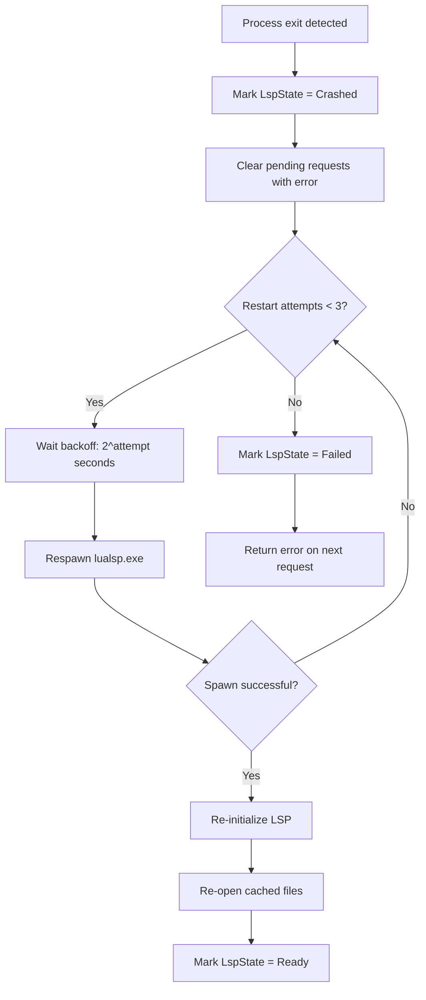

---

## 8. Threading Model

### Async Architecture

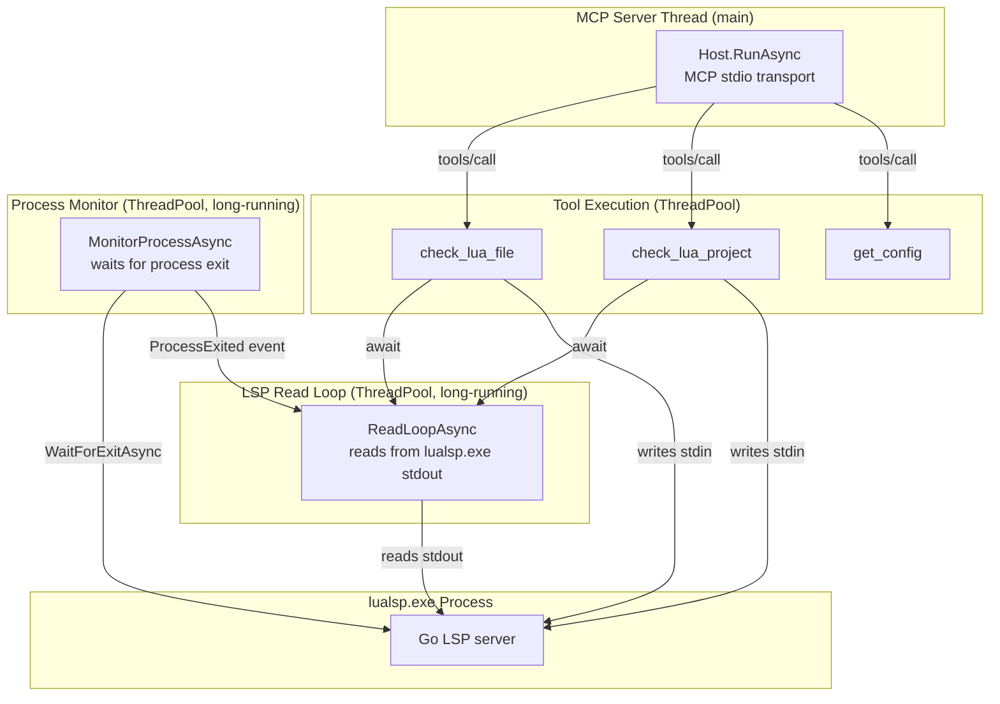

### Key Threading Rules

1. **All I/O is async** — `async Task` throughout, no blocking calls
2. **Single read loop** — One `ReadLoopAsync` background task reads from `lualsp.exe` stdout. It dispatches:
   - Responses (with `id`) → `TaskCompletionSource<JsonElement>` in `_pendingRequests` dictionary
   - Notifications (no `id`) → handlers (e.g., `publishDiagnostics` → cache)
3. **Concurrent writes** — All writes to `lualsp.exe` stdin go through a `SemaphoreSlim(1,1)` to prevent interleaved messages
4. **Cancellation** — All async methods accept `CancellationToken`. The MCP SDK passes the token from the tool call
5. **Timeouts** — `initialize`: 30s, `publishDiagnostics` wait: 10s per file, `process exit` wait: 5s graceful before force kill
6. **No `Console.WriteLine`** — All logging goes to stderr via `ILogger` with `LogToStandardErrorThreshold = LogLevel.Trace`

### Concurrency Primitives

| Primitive | Purpose |
|---|---|
| `SemaphoreSlim(1,1)` `_writeLock` | Serializes writes to lualsp.exe stdin |
| `ConcurrentDictionary<int, TaskCompletionSource<JsonElement>>` `_pendingRequests` | Maps request IDs to awaiting callers |
| `Channel<JsonElement>` `_diagnosticChannel` | Backpressure-safe queue for diagnostics notifications |
| `lock` on `_state` | Protects state transitions |

---

## 9. Configuration

### appsettings.json (MCP Server Config)

```json
{
  "LuaHelper": {
    "LualspPath": "lualsp/win-x64/lualsp.exe",
    "DefaultTimeout": "00:00:30",
    "DiagnosticTimeout": "00:00:10",
    "MaxRestarts": 3,
    "BackoffScheduleSeconds": [2, 4, 8],
    "IdleTimeoutMinutes": 10,
    "DefaultChecks": {
      "AllEnable": true,
      "CheckSyntax": true,
      "CheckNoDefine": false,
      "CheckAfterDefine": false,
      "CheckLocalNoUse": false,
      "CheckTableDuplicateKey": true,
      "CheckReferNoFile": false,
      "CheckAssignParamNum": true,
      "CheckLocalDefineParamNum": true,
      "CheckGotoLable": true,
      "CheckFuncParam": false,
      "CheckImportModuleVar": false,
      "CheckIfNotVar": false,
      "CheckFunctionDuplicateParam": true,
      "CheckBinaryExpressionDuplicate": false,
      "CheckErrorOrAlwaysTrue": false,
      "CheckErrorAndAlwaysFalse": false,
      "CheckNoUseAssign": false,
      "CheckAnnotateType": true,
      "CheckDuplicateIf": true,
      "CheckSelfAssign": false,
      "CheckFloatEq": false
    }
  },
  "Logging": {
    "LogLevel": {
      "Default": "Information"
    }
  }
}
```

### luahelper.json (Project-Level Config)

Placed at the project root. Overrides defaults:

```json
{
  "BaseDir": "./",
  "ShowWarnFlag": 1,
  "ReferMatchPathFlag": 0,
  "IgnoreFileNameVarFlag": 0,
  "ProjectFiles": [],
  "IgnoreModules": ["C_Container", "C_UnitAuras", "C_Timer", "C_AddOns"],
  "IgnoreFileVars": [],
  "IgnoreReadFiles": [],
  "IgnoreErrorTypes": [],
  "IgnoreFileOrFloder": [".vscode/", "Tests/"],
  "IgnoreFileErr": [],
  "IgnoreFileErrTypes": [],
  "ProtocolVars": [],
  "ReferFrameFiles": [],
  "PathSeparator": "."
}
```

### ConfigService Behavior

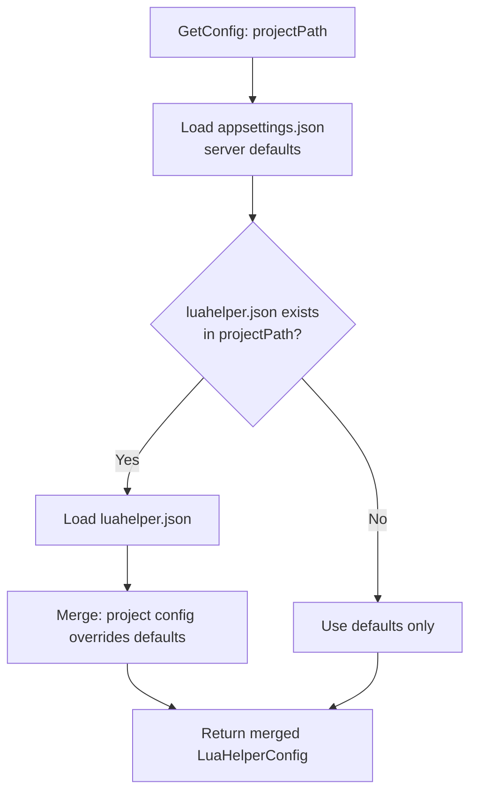

---

## 10. Testing Strategy

### Test Pyramid

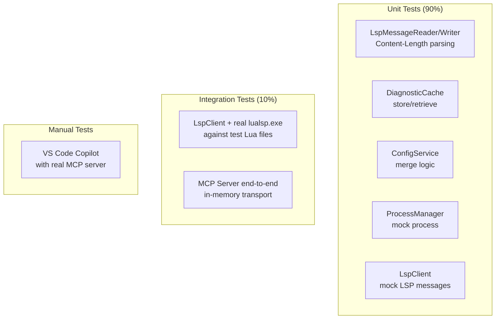

### Unit Testing Approach

**Mock `lualsp.exe`** with a fake LSP server that runs in-process:

```csharp
public class FakeLspServer
{
    private readonly Channel<JsonElement> _input = Channel.CreateUnbounded<JsonElement>();
    private readonly Channel<JsonElement> _output = Channel.CreateUnbounded<JsonElement>();

    public async Task RunAsync(CancellationToken ct)
    {
        await foreach (var msg in _input.Reader.ReadAllAsync(ct))
        {
            if (msg.TryGetProperty("method", out var method))
            {
                switch (method.GetString())
                {
                    case "initialize":
                        _output.Writer.WriteAsync(new
                        {
                            jsonrpc = "2.0",
                            id = msg.GetProperty("id").GetInt32(),
                            result = new { capabilities = new { } }
                        }, ct);
                        break;
                    case "textDocument/didOpen":
                        // Simulate diagnostics
                        _output.Writer.WriteAsync(new
                        {
                            jsonrpc = "2.0",
                            method = "textDocument/publishDiagnostics",
                            @params = new
                            {
                                uri = msg.GetProperty("params").GetProperty("textDocument").GetProperty("uri").GetString(),
                                diagnostics = new[] { new { range = new { start = new { line = 0, character = 0 } }, message = "Test warning", severity = 2 } }
                            }
                        }, ct);
                        break;
                }
            }
        }
    }
}
```

**Test LspClient with in-memory pipes:**

```csharp
[Fact]
public async Task LspClient_Initialize_SendsCorrectMessage()
{
    // Arrange
    var (serverStream, clientStream) = CreatePipePair();
    var fakeServer = new FakeLspServer(serverStream);
    var processManager = new MockProcessManager(clientStream);
    var lspClient = new LspClient(processManager, new DiagnosticCache(), NullLogger<LspClient>.Instance);

    // Act
    await lspClient.EnsureInitializedAsync("C:\\test", new LuaHelperConfig(), CancellationToken.None);

    // Assert
    Assert.Equal(LspState.Ready, lspClient.State);
}
```

### Integration Testing

Use the **real `lualsp.exe`** with a small test Lua project:

```csharp
[Fact]
public async Task CheckLuaFile_RealLualsp_ReturnsDiagnostics()
{
    // Arrange
    var lspClient = CreateRealLspClient(); // uses bundled lualsp.exe
    var testFile = Path.Combine(TestDataPath, "test_with_warning.lua");
    File.WriteAllText(testFile, "---@type Frame\nlocal x = nil;\n");

    // Act
    await lspClient.EnsureInitializedAsync(TestDataPath, new LuaHelperConfig(), CancellationToken.None);
    await lspClient.OpenFileAsync(testFile, CancellationToken.None);
    var diagnostics = await lspClient.GetDiagnosticsAsync(testFile, CancellationToken.None);

    // Assert
    Assert.NotEmpty(diagnostics);
    Assert.Contains(diagnostics, d => d.Message.Contains("Frame"));
}
```

### Test Project Structure

```
LuaHelperMcpServer.Tests/
├── Unit/
│   ├── LspMessageReaderTests.cs
│   ├── LspMessageWriterTests.cs
│   ├── DiagnosticCacheTests.cs
│   ├── ConfigServiceTests.cs
│   ├── ProcessManagerTests.cs
│   └── LspClientTests.cs
├── Integration/
│   ├── LspClientIntegrationTests.cs    # Uses real lualsp.exe
│   └── McpServerEndToEndTests.cs       # In-memory MCP transport
├── Fixtures/
│   ├── test_with_warning.lua
│   ├── test_clean.lua
│   └── luahelper.json
└── Helpers/
    ├── FakeLspServer.cs
    ├── MockProcessManager.cs
    └── PipeHelpers.cs
```

---

## 11. Development Phases

### Phase 0: Proof of Concept

**Goal:** .NET console app that talks to `lualsp.exe` and prints diagnostics.

| Task | DoD |
|---|---|
| Create .NET 10 console project | `dotnet build` succeeds |
| Implement `LspMessageReader` | Parses `Content-Length`-framed JSON-RPC messages from a stream |
| Implement `LspMessageWriter` | Serializes and frames JSON-RPC messages |
| Implement `ProcessManager` | Spawns `lualsp.exe -mode=1`, captures stdin/stdout, detects exit |
| Implement `LspClient.Initialize` | Sends `initialize` + `initialized`, receives capabilities |
| Implement `LspClient.OpenFile` | Sends `textDocument/didOpen` |
| Implement diagnostics collection | Receives `publishDiagnostics`, prints to console |
| Test against ArenaChillPrep | Produces same 17 diagnostics as `luahelper_lsp.js` |

**Deliverable:** `dotnet run -- project "E:\Repository\ArenaChillPrep"` prints all diagnostics.

### Phase 1: Core MCP Server ✅ COMPLETE

**Goal:** MCP server with 2 tools, connectable to VS Code Copilot.

| Task | DoD |
|---|---|
| Add `ModelContextProtocol` NuGet package | Package restored |
| Implement `Program.cs` with DI + stdio transport | Server starts and responds to `initialize` |
| Implement `check_lua_file` tool | Returns diagnostics for a single file |
| Implement `check_lua_project` tool | Returns diagnostics for all `.lua` files in a directory |
| Implement `DiagnosticCache` | Stores diagnostics by URI, supports retrieval |
| Test with VS Code Copilot | Copilot can call `check_lua_file` and get results |

**Note (found during Phase 1):** MCP stdio framing is **newline-delimited JSON-RPC** (one JSON message per line, LF or CRLF), NOT `Content-Length` framing. This differs from the LSP wire format used to talk to `lualsp.exe`. The `ModelContextProtocol` C# SDK handles framing internally — tool implementations must never write to stdout directly (only `ILogger` to stderr).

**Deliverable:** VS Code `settings.json` with MCP server config → Copilot can check Lua files.

### Phase 2: Full Tool Set

**Goal:** All tools, resources, and prompts from the research doc.

| Task | DoD |
|---|---|
| Implement `get_supported_checks` tool | Returns all 21 check types (research doc section 4) with descriptions |
| Implement `get_luahelper_version` tool | Returns version string |
| Implement `get_luahelper_config` tool | Returns current config as JSON |
| Implement `create_luahelper_json` tool | Creates default config file in project root |
| Add MCP resources (`luahelper://diagnostics/{path}`) | Resources are listable and readable |
| Add MCP prompts (`fix_lua_warnings`, `configure_luahelper`) | Prompts are listable and callable |

**Deliverable:** Full MCP server with all capabilities declared.

### Phase 3: Configuration ✅ COMPLETE

**Goal:** Full `luahelper.json` support and customizable check flags.

| Task | DoD |
|---|---|
| Implement `ConfigService` | Loads and merges `appsettings.json` + `luahelper.json` |
| Map `luahelper.json` fields to `initializationOptions` | All config fields are respected by lualsp.exe |
| Support `IgnoreModules` for WoW globals | WoW API globals don't produce "undefined" warnings |
| Support per-file ignore patterns | Ignored files are skipped during project scan |
| Support per-type ignore patterns | Ignored warning types are filtered from results |

**Deliverable:** A WoW addon project with `luahelper.json` produces zero false positives.

### Phase 4: lualsp Provisioning + VS Code Extension ✅ COMPLETE

**Goal:** No dependency on a pre-installed LuaHelper extension. Provision lualsp (detect → download → update → bundle) and wrap the MCP server in a VS Code extension for one-click install from the Marketplace.

**Result:** `.github/tools/fetch-lualsp.ps1` provisions `lualsp/{rid}/` + `version.json` (Marketplace VSIX download with `code-cli` fallback, verified on a machine with no extension installed); `.github/tools/build-vsix.ps1` packages `vscode-extension/luahelper-mcp-0.1.0.vsix` (NativeAOT publish with self-contained fallback — this machine lacks the MSVC platform linker); the extension installs and the bundled server passes a full MCP handshake with real diagnostics.

| Task | DoD |
|---|---|
| Create `.github/tools/fetch-lualsp.ps1` provisioning script | Detects installed lualsp versions, downloads when missing, offers updates, forms the bundle |
| Form `lualsp/{rid}/` bundle + `version.json` manifest | Bundle is reproducible by the script; `ProcessManager` can launch it |
| Create `vscode-extension/` folder with `package.json` | Extension manifest valid |
| Add `contributes.mcpServers` declaration | VS Code auto-starts the MCP server |
| Bundle compiled MCP server binary | Binary included in `.vsix` |
| Bundle `lualsp.exe` (platform-specific) | Win/Linux/macOS binaries included |
| Write README.md with install instructions | User can install and use in < 1 minute |
| Publish to Marketplace (or package as `.vsix`) | `vsce package` produces valid `.vsix` |

**Deliverable:** `.vsix` file that installs the MCP server + lualsp.exe and auto-registers with VS Code.

### Phase 5: NativeAOT + Distribution

**Goal:** Single-file AOT binary, CI/CD, release.

| Task | DoD |
|---|---|
| Enable NativeAOT compilation | `dotnet publish -r win-x64 -p:PublishAot=true` produces single `.exe` |
| Test AOT binary with MCP clients | Works with VS Code Copilot and Claude Desktop |
| Set up GitHub Actions CI | Build + test on push, publish on release |
| Create release pipeline | AOT binaries for win-x64, linux-x64, osx-x64 |
| Write user documentation | README with quickstart, config reference, troubleshooting |

**Deliverable:** GitHub release with platform-specific binaries + VS Code extension `.vsix`.

---

## 12. Project Structure

```
luahelper-mcp/
├── .github/
│   ├── docs/
│   │   ├── research-luahelper-mcp-server.md   # Research document
│   │   └── arch-luahelper-mcp-server.md       # This file
│   ├── tools/
│   │   ├── build.ps1                          # Build solution
│   │   ├── test.ps1                           # Run tests
│   │   ├── deploy.ps1                         # AOT publish + copy lualsp
│   │   └── fetch-lualsp.ps1                   # Detect/download/update/bundle lualsp
│   └── workflows/
│       ├── ci.yml                              # Build + test
│       └── release.yml                         # AOT publish + release
├── src/
│   ├── LuaHelperMcpServer/
│   │   ├── Program.cs                          # Entry point, DI, stdio transport
│   │   ├── LuaHelperMcpServer.csproj           # Project file (net10.0, AOT)
│   │   ├── appsettings.json                    # Default config
│   │   ├── Tools/
│   │   │   ├── LuaDiagnosticTools.cs           # check_lua_file, check_lua_project, etc.
│   │   │   └── ConfigTools.cs                  # get_config, create_luahelper_json
│   │   ├── Services/
│   │   │   ├── ILspClient.cs                   # Interface
│   │   │   ├── LspClient.cs                    # LSP protocol client
│   │   │   ├── IProcessManager.cs              # Interface
│   │   │   ├── ProcessManager.cs               # lualsp.exe lifecycle
│   │   │   ├── IDiagnosticCache.cs             # Interface
│   │   │   ├── DiagnosticCache.cs              # In-memory cache
│   │   │   ├── IConfigService.cs               # Interface
│   │   │   ├── ConfigService.cs                # Config loader/merger
│   │   │   ├── LspMessageReader.cs             # Content-Length parser
│   │   │   └── LspMessageWriter.cs             # JSON-RPC serializer
│   │   ├── Models/
│   │   │   ├── LuaDiagnostic.cs                # Diagnostic model
│   │   │   ├── DiagnosticSeverity.cs           # Enum
│   │   │   ├── LspState.cs                     # State enum
│   │   │   ├── LuaHelperConfig.cs              # Config model
│   │   │   ├── LuaHelperOptions.cs             # appsettings options
│   │   │   └── InitializeOptions.cs            # LSP init options
│   │   └── Extensions/
│   │       └── ServiceCollectionExtensions.cs  # DI registration helpers
│   └── LuaHelperMcpServer.Tests/
│       ├── LuaHelperMcpServer.Tests.csproj
│       ├── Unit/
│       │   ├── LspMessageReaderTests.cs
│       │   ├── LspMessageWriterTests.cs
│       │   ├── DiagnosticCacheTests.cs
│       │   ├── ConfigServiceTests.cs
│       │   ├── ProcessManagerTests.cs
│       │   └── LspClientTests.cs
│       ├── Integration/
│       │   ├── LspClientIntegrationTests.cs
│       │   └── McpServerEndToEndTests.cs
│       ├── Fixtures/
│       │   ├── test_with_warning.lua
│       │   ├── test_clean.lua
│       │   └── luahelper.json
│       └── Helpers/
│           ├── FakeLspServer.cs
│           ├── MockProcessManager.cs
│           └── PipeHelpers.cs
├── lualsp/                                     # Bundled lualsp.exe binaries
│   ├── win-x64/
│   │   └── lualsp.exe
│   ├── linux-x64/
│   │   └── lualsp
│   └── osx-x64/
│       └── lualsp
├── vscode-extension/                           # VS Code extension wrapper
│   ├── package.json
│   ├── extension.js                            # Activation logic
│   ├── .vscodeignore
│   └── README.md
├── LuaHelperMcpServer.sln
├── .gitignore
├── LICENSE                                     # MIT (our code) + BSD-3-Clause notice for lualsp.exe
└── README.md
```

---

## 13. Open Questions: Decisions

### Q1: Bundle lualsp.exe or download?

**Recommendation: Bundle.**

- `lualsp.exe` is only ~10 MB per platform
- Bundling ensures offline operation and version consistency
- BSD-3-Clause license allows redistribution with attribution
- Downloading adds complexity (URL management, checksums, network errors)
- **Decision:** Bundle in `lualsp/{rid}/` folder, include LICENSE notice
- **Follow-up (Phase 4):** the bundle is produced by `.github/tools/fetch-lualsp.ps1`, which copies lualsp from an installed `yinfei.luahelper` extension or downloads the Marketplace VSIX when the extension is absent — the machine never requires the extension to be pre-installed.

### Q2: All 22 check types or subset?

**Recommendation: All 22, with sensible defaults.**

- The MCP server is a general-purpose tool, not WoW-specific
- Defaults match LuaHelper VS Code extension defaults (from research doc)
- Users can override via `luahelper.json` or tool parameters
- **Decision:** Support all 22 types, default to LuaHelper's default settings

### Q3: VS Code Extension from day 1?

**Recommendation: No — start standalone, add extension in Phase 4.**

- Phase 0–3 deliver a working standalone MCP server
- VS Code extension is a packaging concern, not a feature
- Starting standalone allows faster iteration
- **Decision:** Phase 4 adds the VS Code extension wrapper

### Q4: Fix `-mode=0` (cmd) or forget it?

**Recommendation: Forget it for now.**

- `-mode=0` produced no output in testing
- LSP mode (`-mode=1`) is proven to work
- Investigating cmd mode is a time sink with uncertain payoff
- LSP mode's statefulness is manageable with the `ProcessManager` + `DiagnosticCache`
- **Decision:** Use LSP mode only. Revisit cmd mode only if state management becomes a burden.

### Q5: HTTP transport?

**Recommendation: No — stdio only for v1.**

- stdio is the standard for local MCP servers
- HTTP transport adds ASP.NET Core dependency (larger binary, more complexity)
- CI use case can be served by running the stdio server in a subprocess
- **Decision:** stdio only for v1. Add HTTP transport in a future version if there's demand.

### Q6: PluginPath initialization option?

**Recommendation: Pass the `lualsp/` directory path.**

- In VS Code extension mode: `${extensionPath}/lualsp/{rid}`
- In standalone mode: path relative to the MCP server binary, or from `appsettings.json`
- `PluginPath` is used by lualsp.exe for resolving meta files — it needs the directory containing the binary
- **Decision:** Set `PluginPath` to the directory containing `lualsp.exe`, auto-detected or from config

---

## 14. Technology Stack Summary

| Component | Technology | Version |
|---|---|---|
| Language | C# | 12 |
| Runtime | .NET | 8 (LTS) |
| MCP SDK | `ModelContextProtocol` | 2.1.0 |
| Hosting | `Microsoft.Extensions.Hosting` | 8.0 |
| JSON | `System.Text.Json` | built-in |
| Logging | `Microsoft.Extensions.Logging` + Console (stderr) | 8.0 |
| Testing | xUnit + FluentAssertions | latest |
| AOT | NativeAOT | .NET 10 built-in |
| LSP Server | `lualsp.exe` (LuaHelper) | 0.2.29 (bundled) |
| VS Code Extension | TypeScript + `vsce` | latest |
| CI/CD | GitHub Actions | — |

### Key NuGet Packages

```xml
<!-- LuaHelperMcpServer.csproj -->
<Project Sdk="Microsoft.NET.Sdk">
  <PropertyGroup>
    <OutputType>Exe</OutputType>
    <TargetFramework>net10.0</TargetFramework>
    <ImplicitUsings>enable</ImplicitUsings>
    <Nullable>enable</Nullable>
    <PublishAot>true</PublishAot>
  </PropertyGroup>
  <ItemGroup>
    <PackageReference Include="ModelContextProtocol" Version="2.1.0" />
    <PackageReference Include="Microsoft.Extensions.Hosting" Version="8.0.0" />
  </ItemGroup>
</Project>
```

---

## References

- [Research Document](./research-luahelper-mcp-server.md)
- [MCP Specification — Tools](https://modelcontextprotocol.io/specification/2026-07-28/server/tools.md)
- [MCP Specification — Resources](https://modelcontextprotocol.io/specification/2026-07-28/server/resources.md)
- [MCP Specification — stdio Transport](https://modelcontextprotocol.io/specification/2026-07-28/basic/transports/stdio.md)
- [MCP C# SDK](https://github.com/modelcontextprotocol/csharp-sdk)
- [MCP C# SDK — Getting Started](https://github.com/modelcontextprotocol/csharp-sdk/blob/main/docs/concepts/getting-started.md)
- [MCP C# SDK — Transports](https://github.com/modelcontextprotocol/csharp-sdk/blob/main/docs/concepts/transports/transports.md)
- [LuaHelper](https://github.com/Tencent/LuaHelper)
- [LuaHelper Config](https://github.com/Tencent/LuaHelper/blob/master/docs/manual/config.md)
- [VS Code Extension Publishing](https://code.visualstudio.com/api/working-with-extensions/publishing-extension)
